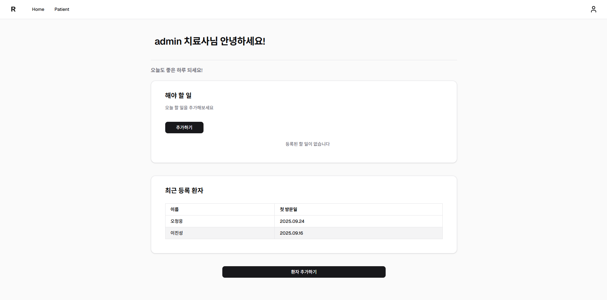
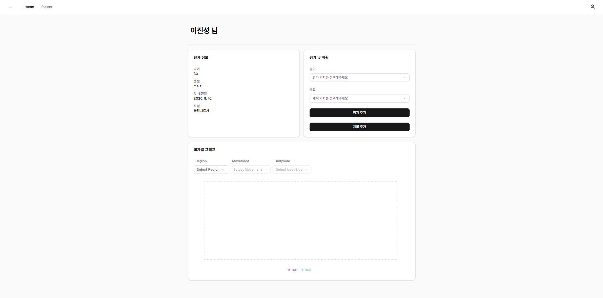
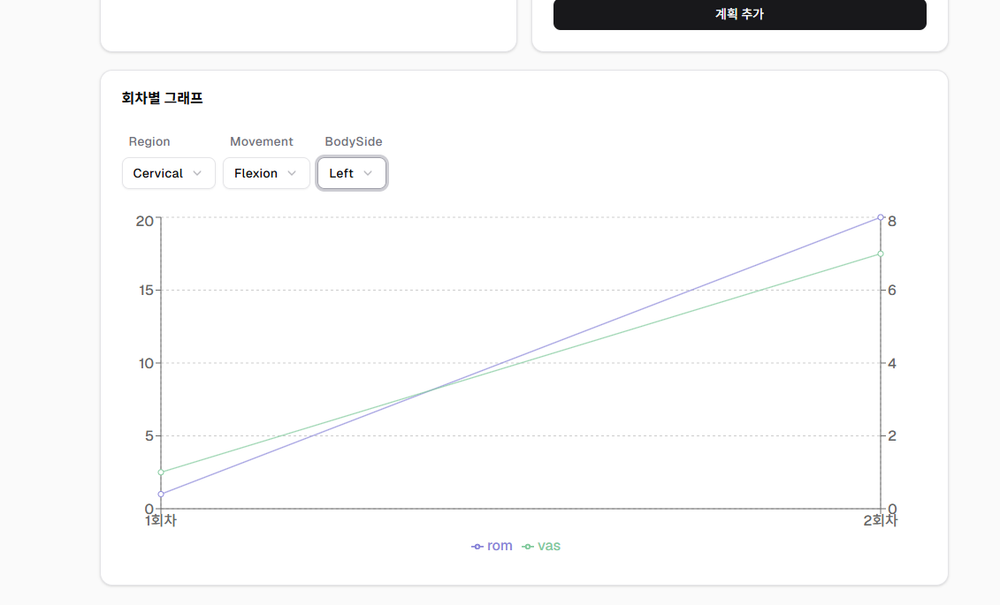
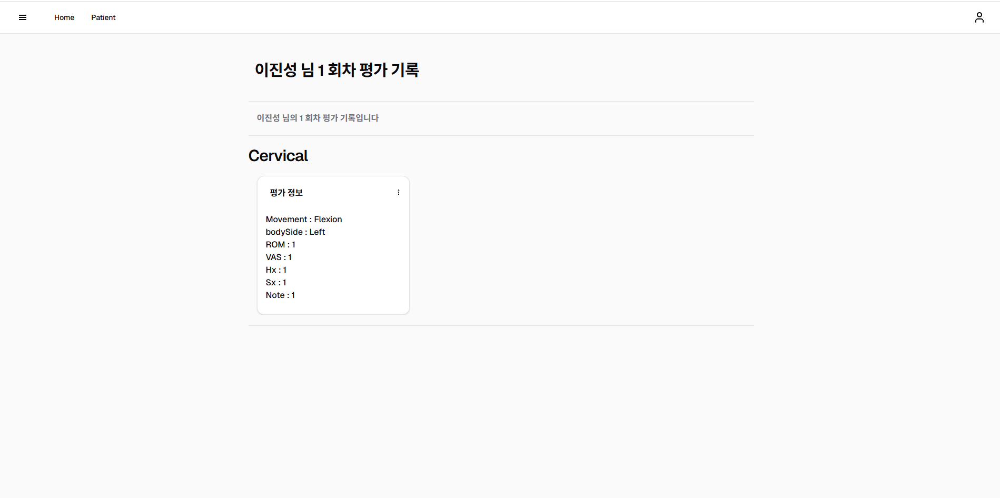

# ChartPT
물리치료사들을 위한 환자 평가 관리 시스템입니다
[verce](https://chartptfront.vercel.app/)

## 개요
환자의 통증 부위, 가동 범위, 움직임 데이터를 기반으로 평가하고
환자 치료 계획, 운동 계획 등을 관리하는 시스템

## 기술 스택
- Frontend : Next.JS, React
- Backend : Node.JS(Express)
- Database : MySQL

## 레포지토리
- Frontend : https://github.com/pro047/ChartPT_Front
- Backend : https://github.com/pro047/ChartPT_Back

## 스크린샷
- 메인 페이지
  
- 환자 페이지
  
- 라인 그래프 페이지
  
- 평가 조회 페이지
  
